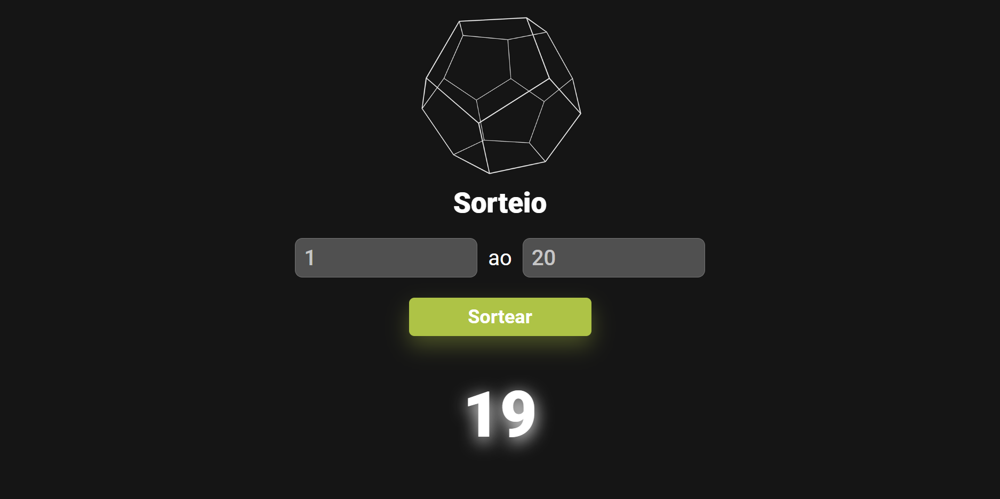

<h1 align="center">Sorteador de Números</h1>
 

Site para sortear números entre valores mínimos e máximos fornecidos pelo usuário.

<h2 align="center">Como Usar?</h2>

1. Insira os valores mínimo e máximo nos campos correspondentes.

2. Clique no botão "Sortear" para gerar um número aleatório no intervalo especificado.

⚠️ Não insira números maiores do que o valor máximo no campo de valor mínimo

<h3 align="center">Portabilidade</h3>

O site é responsivo e se ajusta a diferentes tamanhos de tela. O layout foi projetado para proporcionar uma experiência de usuário amigável em dispositivos móveis e desktops.

<table align="center">
  <tr>
    <td>
      <figure>
        <figcaption>Desktop:</figcaption>
        
        
      </figure>
    </td>
    <td>
     <figure>
       <figcaption>Tablet:</figcaption>
       
     </figure> 
    </td>
    <td>
     <figure>
       <figcaption>Mobile:</figcaption>
       
     </figure> 
    </td>
  </tr>
</table>
<h4 align="center">Tecnologias Utilizadas</h4>
 

  

 

 

